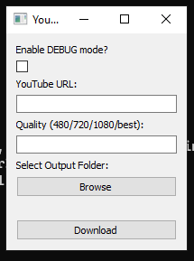

# YTTT
# YouTubeTerminalTerminal

Free youtube downloader using **python**, **yt-dlp**, **aria2**, **ffmpeg**.

jsut linux, windows

## commanline ui

## todo:

- gui([qt5-gui](https://github.com/saeedkhatami/YTTT/tree/qt5-gui) branch)
- tui
- move from python to c++
- cross-platform

## long term todo:

- youtube explorer application with some options
